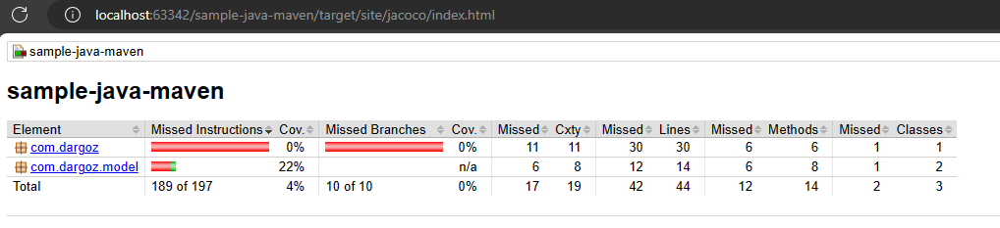

# Overview

This project demonstrate minimum example code how to run unit test with jacoco report.

## How to Generate Jacoco Report
as already configured through `pom.xml`, you can directly run `mvn:test` without single test failures to make jacoco report generated

screenshot:

